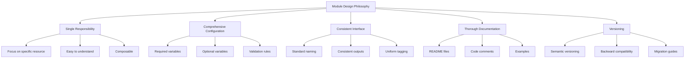
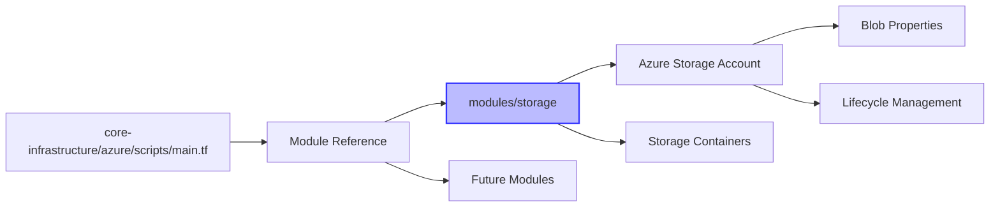
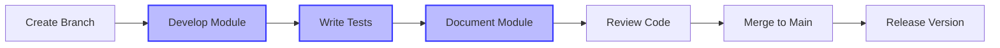
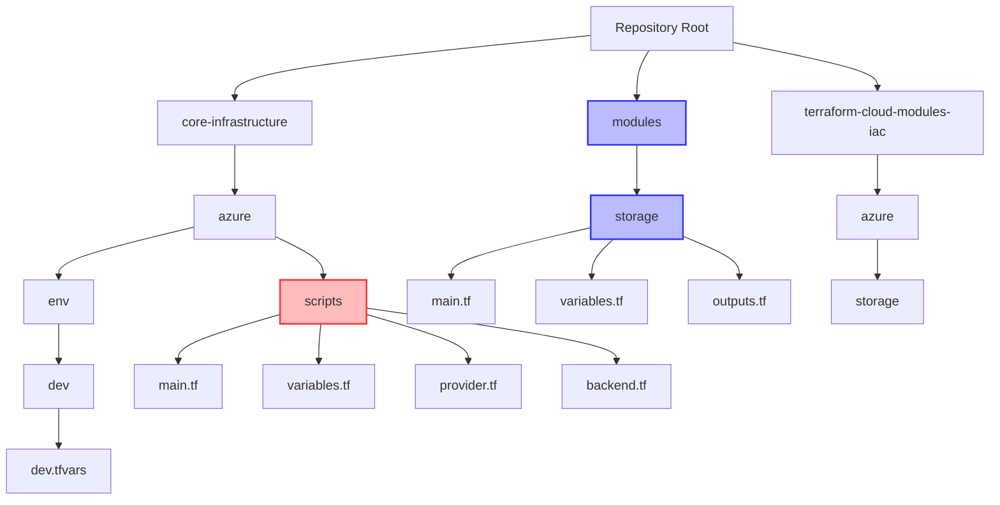
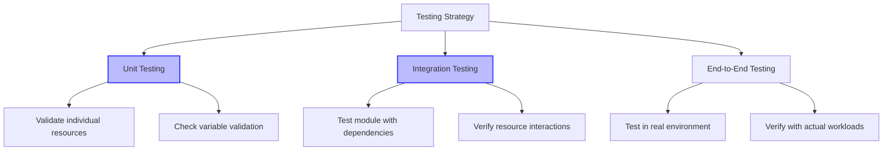
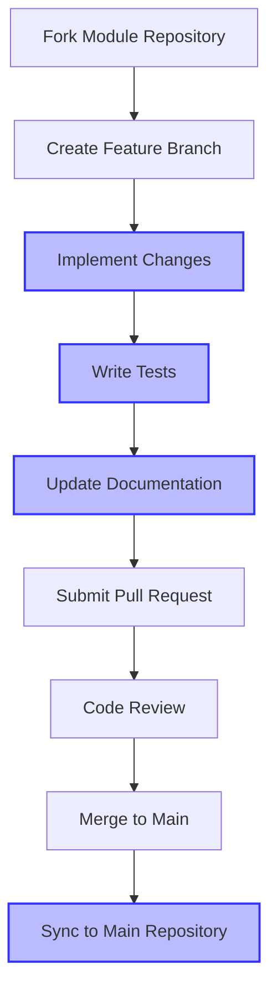
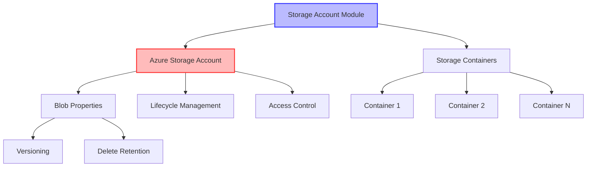

# Terraform Cloud Modules Playbook

## Introduction

This playbook serves as a comprehensive guide for working with the `terraform-cloud-modules-iac` repository and its integration with the main `cicd` repository. It provides detailed instructions, best practices, and workflows for developing, testing, and using the reusable Terraform modules.

In our infrastructure setup, we use a specific approach where:

1. The `terraform-cloud-modules-iac` repository contains all the reusable Terraform modules
2. These modules are copied to the `modules` directory in the main `cicd` repository
3. Terraform configurations in `core-infrastructure/azure/scripts` reference these local modules using relative paths (`../../modules/<Service>`)

This approach simplifies dependency management and CI/CD integration while maintaining the benefits of modular infrastructure code.

## Table of Contents

1. [Repository Overview](#repository-overview)
2. [Module Architecture](#module-architecture)
3. [Development Workflow](#development-workflow)
4. [Module Usage Patterns](#module-usage-patterns)
5. [Testing Strategy](#testing-strategy)
6. [Versioning and Releases](#versioning-and-releases)
7. [Contribution Guidelines](#contribution-guidelines)
8. [Troubleshooting](#troubleshooting)
9. [Azure Module Reference](#azure-module-reference)

## Repository Overview

The `terraform-cloud-modules-iac` repository contains reusable Terraform modules for deploying infrastructure across multiple cloud providers, with a primary focus on Azure. These modules are designed to be copied to the `modules` directory in the main repository, rather than being referenced directly from Git.

### Repository Structure

```
# Module Repository Structure
terraform-cloud-modules-iac/
├── azure/                # Azure modules
│   └── storage/          # Azure Storage Account module
│       ├── main.tf       # Main module configuration
│       ├── variables.tf  # Input variable definitions
│       ├── outputs.tf    # Output definitions
│       └── README.md     # Module documentation
├── gcp/                  # Google Cloud Platform modules (planned)
├── .gitignore            # Git ignore file
├── README.md             # Repository documentation
└── PLAYBOOK.md           # This comprehensive guide

# Main Repository Structure
cicd/
├── core-infrastructure/  # Core infrastructure configurations
│   ├── azure/            # Azure-specific configurations
│   │   ├── env/          # Environment-specific variables
│   │   │   └── dev/      # Development environment
│   │   │       └── dev.tfvars  # Variable values for dev
│   │   └── scripts/      # Terraform configurations
│   │       ├── main.tf   # Main configuration referencing modules
│   │       ├── variables.tf  # Variable definitions
│   │       ├── provider.tf   # Provider configuration
│   │       └── backend.tf    # Backend configuration
├── modules/              # Local copy of modules from terraform-cloud-modules-iac
│   └── storage/          # Storage module copied from terraform-cloud-modules-iac
│       ├── main.tf       # Main module configuration
│       ├── variables.tf  # Input variable definitions
│       └── outputs.tf    # Output definitions
└── terraform-cloud-modules-iac/  # Original module repository (reference only)
```

## Module Architecture

### Design Philosophy



### Module Structure

Each module follows a consistent structure:

1. **main.tf**: Contains the primary resource definitions
2. **variables.tf**: Defines all input variables with descriptions and defaults
3. **outputs.tf**: Defines the outputs that the module will expose
4. **README.md**: Provides documentation for the module

### Module Relationships



## Development Workflow

### Module Development Lifecycle



### Development Environment Setup

1. **Clone Both Repositories**

   ```powershell
   # Clone the main repository
   git clone https://github.com/your-org/cicd.git
   cd cicd

   # Clone the modules repository (if not already included)
   git clone https://github.com/your-org/terraform-cloud-modules-iac.git
   ```

2. **Create a Feature Branch in the Module Repository**

   ```powershell
   cd terraform-cloud-modules-iac
   git checkout -b feature/new-module-name
   ```

3. **Initialize Development Environment**

   ```powershell
   # Install required Terraform version
   terraform -version  # Verify version >= 1.3.0

   # Set up Azure credentials for testing (if working on Azure modules)
   $env:ARM_CLIENT_ID = "your-client-id"
   $env:ARM_CLIENT_SECRET = "your-client-secret"
   $env:ARM_SUBSCRIPTION_ID = "your-subscription-id"
   $env:ARM_TENANT_ID = "your-tenant-id"
   ```

4. **Sync Module to Main Repository**

   After developing or updating a module in the `terraform-cloud-modules-iac` repository, copy it to the `modules` directory in the main repository:

   ```powershell
   # Navigate to the root of the main repository
   cd ../

   # Copy the module
   Copy-Item -Path "terraform-cloud-modules-iac/azure/storage" -Destination "modules/storage" -Recurse -Force
   ```

### Creating a New Module

1. **Create Module Directory Structure in the Module Repository**

   ```powershell
   # Navigate to the module repository
   cd terraform-cloud-modules-iac

   # Create the module directory
   mkdir -p azure/new-module-name
   cd azure/new-module-name
   ```

2. **Create Basic Module Files**

   ```powershell
   # Create main.tf, variables.tf, outputs.tf, and README.md
   New-Item -ItemType File -Name main.tf
   New-Item -ItemType File -Name variables.tf
   New-Item -ItemType File -Name outputs.tf
   New-Item -ItemType File -Name README.md
   ```

3. **Copy to Main Repository After Development**

   ```powershell
   # Navigate to the root of the main repository
   cd ../../../..

   # Create the module directory in the main repository if it doesn't exist
   mkdir -p modules/new-module-name

   # Copy the module files
   Copy-Item -Path "terraform-cloud-modules-iac/azure/new-module-name/*" -Destination "modules/new-module-name/" -Recurse -Force
   ```

3. **Implement Module Logic**

   Follow these steps when implementing a module:

   - Define all required input variables in `variables.tf`
   - Implement resource creation in `main.tf`
   - Define useful outputs in `outputs.tf`
   - Document the module in `README.md`

4. **Module Implementation Best Practices**

   - Use descriptive variable and output names
   - Provide sensible defaults for optional variables
   - Include validation rules for critical variables
   - Use locals for complex expressions
   - Add meaningful descriptions for all variables and outputs
   - Implement proper error handling
   - Use consistent naming conventions

## Module Usage Patterns

### Repository Structure for Local Module References

In this project, we use a specific structure where modules are copied into the `modules` directory within the main repository, rather than referenced directly from Git. This approach provides several benefits:

1. **Simplified Dependency Management**: No need to manage Git references or versioning in the Terraform code
2. **Offline Development**: Ability to work without network access to the module repository
3. **Version Control**: Each environment can use a specific version of modules by committing them to the repository
4. **CI/CD Integration**: Easier integration with CI/CD pipelines that don't need to clone multiple repositories



### Local Module Reference Pattern

This is the primary pattern used in this project. Modules are referenced from the local `modules` directory:

```hcl
module "storage_account" {
  source = "../../modules/storage"  # Path to your local module

  # Required parameters
  storage_account_name = "mystorageaccount"
  resource_group_name  = "my-resource-group"
  location             = "eastus"

  # Optional parameters with custom values
  account_tier             = "Standard"
  account_replication_type = "LRS"

  # Complex parameters
  containers = [
    {
      name        = "data"
      access_type = "private"
    }
  ]

  # Tags
  tags = {
    Environment = "Production"
    Department  = "IT"
  }
}
```

### Composition Pattern with Local Modules

```hcl
# Create a resource group
module "resource_group" {
  source = "../../modules/resource-group"  # Path to your local module

  name     = "rg-data-platform"
  location = "eastus"
  tags     = local.common_tags
}

# Create a storage account in the resource group
module "storage_account" {
  source = "../../modules/storage"  # Path to your local module

  storage_account_name = "stdataplatform"
  resource_group_name  = module.resource_group.name
  location             = module.resource_group.location

  # ... other parameters

  tags = local.common_tags

  # Ensure the resource group exists before creating the storage account
  depends_on = [module.resource_group]
}
```

### Module Synchronization

To keep the local modules in sync with the `terraform-cloud-modules-iac` repository, you can:

1. **Manual Copy**: Copy updated modules from `terraform-cloud-modules-iac` to the `modules` directory
2. **Script-based Sync**: Use a script to copy modules during CI/CD or development
3. **Git Submodules**: Use Git submodules if more advanced version control is needed

Example synchronization script:

```powershell
# Example script to sync modules
$sourceDir = "terraform-cloud-modules-iac/azure"
$destDir = "modules"

# Create destination directory if it doesn't exist
if (!(Test-Path $destDir)) {
    New-Item -ItemType Directory -Path $destDir
}

# Copy Azure modules
Copy-Item -Path "$sourceDir/storage" -Destination "$destDir/storage" -Recurse -Force
# Add more modules as needed
```

## Testing Strategy

### Testing Levels



### Testing Workflow

1. **Create Test Directory in the Module Repository**

   ```powershell
   # Navigate to the module repository
   cd terraform-cloud-modules-iac

   # Create test directory
   mkdir -p azure/storage/test
   cd azure/storage/test
   ```

2. **Create Test Files**

   ```powershell
   # Create main test file
   New-Item -ItemType File -Name main.tf
   ```

3. **Implement Basic Test**

   ```hcl
   # main.tf
   provider "azurerm" {
     features {}
   }

   resource "random_string" "suffix" {
     length  = 8
     special = false
     upper   = false
   }

   resource "azurerm_resource_group" "test" {
     name     = "rg-test-${random_string.suffix.result}"
     location = "eastus"
   }

   module "storage_account" {
     source = "../"  # Reference the module being tested

     storage_account_name = "sttest${random_string.suffix.result}"
     resource_group_name  = azurerm_resource_group.test.name
     location             = azurerm_resource_group.test.location

     # Test specific configurations
     account_tier             = "Standard"
     account_replication_type = "LRS"

     containers = [
       {
         name        = "test-container"
         access_type = "private"
       }
     ]

     tags = {
       Environment = "Test"
       Terraform   = "True"
     }
   }

   # Outputs for verification
   output "storage_account_id" {
     value = module.storage_account.storage_account_id
   }

   output "container_names" {
     value = module.storage_account.containers
   }
   ```

4. **Run Tests**

   ```powershell
   # Initialize Terraform
   terraform init

   # Validate configuration
   terraform validate

   # Plan deployment
   terraform plan

   # Apply configuration (create resources)
   terraform apply -auto-approve

   # Verify outputs and resources
   terraform output

   # Clean up resources
   terraform destroy -auto-approve
   ```

## Versioning and Releases

### Semantic Versioning

This repository follows semantic versioning (MAJOR.MINOR.PATCH):

- **MAJOR**: Incompatible API changes
- **MINOR**: Backwards-compatible new functionality
- **PATCH**: Backwards-compatible bug fixes

### Release Process

```mermaid
graph LR
    A[Develop Features] --> B[Create Release Branch]
    B --> C[Update Version Numbers]
    C --> D[Create Release Tag]
    D --> E[Merge to Main]
    E --> F[Publish Release Notes]
    F --> G[Sync to Main Repository]

    style D fill:#bbf,stroke:#33f,stroke-width:2px
    style F fill:#bbf,stroke:#33f,stroke-width:2px
    style G fill:#bbf,stroke:#33f,stroke-width:2px
```



1. **Create a Release Branch in the Module Repository**

   ```powershell
   cd terraform-cloud-modules-iac
   git checkout -b release/v1.0.0
   ```

2. **Update Version References**

   - Update README examples to reference the new version
   - Update any internal version references

3. **Create a Release Tag**

   ```powershell
   git tag -a v1.0.0 -m "Release v1.0.0"
   git push origin v1.0.0
   ```

4. **Merge Release Branch to Main**

   ```powershell
   git checkout main
   git merge release/v1.0.0
   git push origin main
   ```

5. **Create Release Notes**

   Document in GitHub Releases:
   - New features
   - Bug fixes
   - Breaking changes
   - Migration instructions

6. **Sync Released Modules to Main Repository**

   ```powershell
   # Navigate to the main repository root
   cd ../cicd

   # Create a branch for the module update
   git checkout -b update-modules-v1.0.0

   # Copy the released modules
   Copy-Item -Path "../terraform-cloud-modules-iac/azure/storage" -Destination "modules/storage" -Recurse -Force
   # Add more modules as needed

   # Commit and push the changes
   git add modules/
   git commit -m "Update modules to v1.0.0"
   git push origin update-modules-v1.0.0

   # Create a pull request to merge the changes
   ```

## Contribution Guidelines

### Contribution Workflow



### Pull Request Guidelines

1. **Create Focused PRs**
   - Each PR should address a single concern
   - Keep changes small and focused
   - Avoid mixing unrelated changes

2. **PR Description**
   - Clearly describe the purpose of the PR
   - Reference any related issues
   - Explain implementation decisions
   - List any breaking changes

3. **Code Quality**
   - Follow Terraform best practices
   - Ensure code is properly formatted (`terraform fmt`)
   - Pass validation (`terraform validate`)
   - Include appropriate tests

4. **Documentation**
   - Update module README.md
   - Add examples if appropriate
   - Document any new variables or outputs

## Troubleshooting

### Common Issues and Solutions

#### Module Not Found

**Issue**: `Error: Module not found`

**Solution**:
- Check the module path in the source attribute
- Ensure you're using the correct syntax for the source type
- Verify the module exists at the specified path

#### Authentication Failures

**Issue**: `Error: Error acquiring the state lock`

**Solution**:
- Check your Azure credentials
- Verify environment variables are set correctly
- Ensure the service principal has appropriate permissions

#### Resource Creation Failures

**Issue**: `Error: creating/updating resource: [resource type]`

**Solution**:
- Check the error message for specific details
- Verify input parameters are valid
- Ensure the service principal has permissions to create the resource
- Check for resource name conflicts or quota limits

### Debugging Techniques

1. **Enable Terraform Logging**

   ```powershell
   $env:TF_LOG = "DEBUG"
   $env:TF_LOG_PATH = "terraform.log"
   ```

2. **Use Terraform Console**

   ```powershell
   terraform console
   ```

3. **Inspect State**

   ```powershell
   terraform state list
   terraform state show MODULE_NAME.RESOURCE_NAME
   ```

## Azure Module Reference

### Storage Account Module

The Azure Storage Account module (`azure/storage/`) provides a comprehensive solution for deploying and managing Azure Storage resources.

#### Module Diagram



#### Required Parameters

| Parameter | Description | Type |
|-----------|-------------|------|
| `storage_account_name` | Name of the storage account | `string` |
| `resource_group_name` | Name of the resource group | `string` |
| `location` | Azure region where the storage account will be created | `string` |

#### Optional Parameters

| Parameter | Description | Type | Default |
|-----------|-------------|------|---------|
| `account_tier` | Defines the Tier to use for this storage account | `string` | `"Standard"` |
| `account_replication_type` | Defines the type of replication to use | `string` | `"LRS"` |
| `account_kind` | Defines the Kind of account | `string` | `"StorageV2"` |
| `access_tier` | Defines the access tier for BlobStorage | `string` | `"Hot"` |
| `enable_versioning` | Enable versioning for the storage account | `bool` | `false` |
| `enable_delete_retention` | Enable delete retention policy | `bool` | `false` |
| `delete_retention_days` | Number of days to retain deleted blobs | `number` | `7` |
| `enable_container_delete_retention` | Enable container delete retention policy | `bool` | `false` |
| `container_delete_retention_days` | Number of days to retain deleted containers | `number` | `7` |
| `containers` | List of containers to create and their access levels | `list(object)` | `[]` |
| `tags` | A mapping of tags to assign to the resource | `map(string)` | `{}` |

#### Outputs

| Name | Description |
|------|-------------|
| `storage_account_id` | The ID of the storage account |
| `storage_account_name` | The name of the storage account |
| `primary_blob_endpoint` | The endpoint URL for blob storage in the primary location |
| `primary_access_key` | The primary access key for the storage account |
| `secondary_access_key` | The secondary access key for the storage account |
| `containers` | Map of containers |

#### Example Usage

```hcl
module "storage_account" {
  source = "../../modules/storage"  # Path to your local module

  storage_account_name = "mystorageaccount"
  resource_group_name  = "my-resource-group"
  location             = "eastus"

  account_tier             = "Standard"
  account_replication_type = "LRS"
  account_kind             = "StorageV2"
  access_tier              = "Hot"

  enable_versioning                 = true
  enable_delete_retention           = true
  delete_retention_days             = 14
  enable_container_delete_retention = true
  container_delete_retention_days   = 14

  containers = [
    {
      name        = "data"
      access_type = "private"
    },
    {
      name        = "public"
      access_type = "blob"
    }
  ]

  tags = {
    Environment = "Production"
    Department  = "IT"
    Project     = "Data Lake"
  }
}
```
