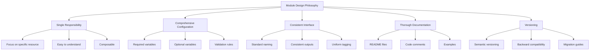
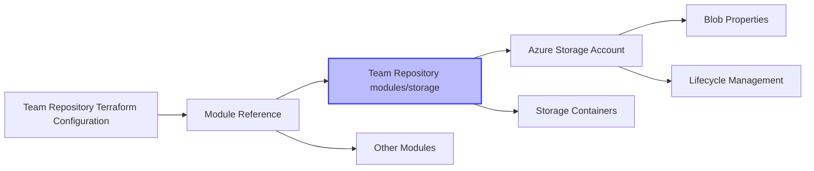
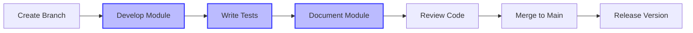
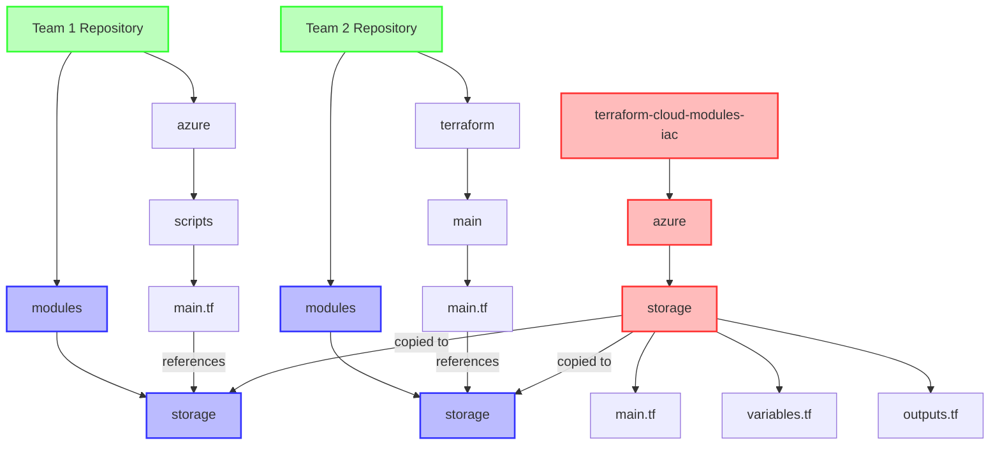
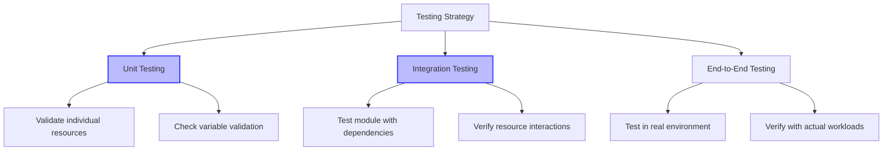
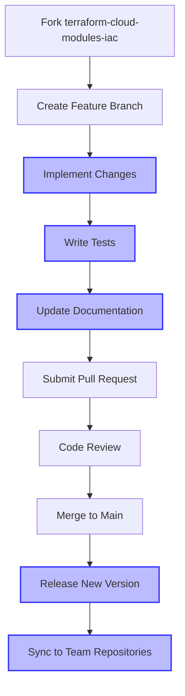
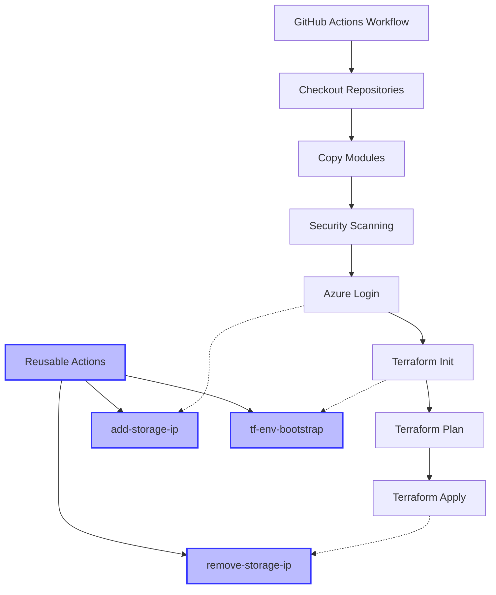
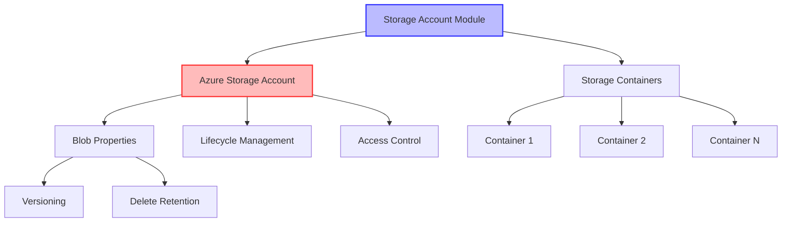

# Terraform Cloud Modules Playbook

## Introduction

This playbook serves as a comprehensive guide for working with the `terraform-cloud-modules-iac` repository. It provides detailed instructions, best practices, and workflows for developing, testing, and using the reusable Terraform modules across different teams and projects.

In our infrastructure setup, we use a specific approach where:

1. The `terraform-cloud-modules-iac` repository serves as a central library containing all reusable Terraform modules
2. Each team or project has its own infrastructure repository (e.g., `core-infrastructure`, `app-infrastructure`, etc.)
3. Teams copy the modules they need from `terraform-cloud-modules-iac` to their own repository's `modules` directory
4. Terraform configurations in each team's repository reference these local modules using relative paths (`../../modules/<Service>`)

This approach provides several benefits:
- **Standardization**: All teams use the same well-tested modules
- **Autonomy**: Teams can work independently without affecting others
- **Simplified Dependency Management**: No need to manage Git references or versioning in the Terraform code
- **Controlled Updates**: Teams can update modules on their own schedule

## Table of Contents

1. [Repository Overview](#repository-overview)
2. [Module Architecture](#module-architecture)
3. [Development Workflow](#development-workflow)
4. [Module Usage Patterns](#module-usage-patterns)
5. [Testing Strategy](#testing-strategy)
6. [Versioning and Releases](#versioning-and-releases)
7. [Contribution Guidelines](#contribution-guidelines)
8. [GitHub Actions and Workspace Integration](#github-actions-and-workspace-integration)
9. [Troubleshooting](#troubleshooting)
10. [Azure Module Reference](#azure-module-reference)

## Repository Overview

Our infrastructure is organized using a central module repository and multiple team-specific infrastructure repositories:

1. **terraform-cloud-modules-iac**: The central repository containing all reusable Terraform modules for deploying infrastructure across multiple cloud providers, with a primary focus on Azure.

2. **Team Infrastructure Repositories**: Each team maintains their own infrastructure repository (e.g., `core-infrastructure`, `app-infrastructure`, `data-platform`, etc.) that references modules from the central repository.

### Repository Structure

```
# Central Module Repository
terraform-cloud-modules-iac/
├── azure/                # Azure modules (source of truth)
│   └── storage/          # Azure Storage Account module
│       ├── main.tf       # Main module configuration
│       ├── variables.tf  # Input variable definitions
│       ├── outputs.tf    # Output definitions
│       └── README.md     # Module documentation
├── gcp/                  # Google Cloud Platform modules (planned)
├── .gitignore            # Git ignore file
├── README.md             # Repository documentation
└── PLAYBOOK.md           # This comprehensive guide

# Example Team Infrastructure Repository (e.g., core-infrastructure)
team-infrastructure-repo/
├── azure/                # Azure-specific configurations
│   ├── env/              # Environment-specific variables
│   │   └── dev/          # Development environment
│   │       └── dev.tfvars  # Variable values for dev
│   └── scripts/          # Terraform configurations
│       ├── main.tf       # Main configuration referencing modules
│       ├── variables.tf  # Variable definitions
│       ├── provider.tf   # Provider configuration
│       └── backend.tf    # Backend configuration
└── modules/              # Local copy of modules from terraform-cloud-modules-iac
    └── storage/          # Storage module
        ├── main.tf       # Main module configuration
        ├── variables.tf  # Input variable definitions
        └── outputs.tf    # Output definitions

# Another Team Infrastructure Repository Example (e.g., app-infrastructure)
another-team-repo/
├── terraform/
│   ├── environments/     # Environment-specific configurations
│   │   ├── dev/          # Development environment
│   │   │   └── terraform.tfvars  # Variable values for dev
│   │   └── prod/         # Production environment
│   │       └── terraform.tfvars  # Variable values for prod
│   └── main/             # Main Terraform configurations
│       ├── main.tf       # Main configuration referencing modules
│       ├── variables.tf  # Variable definitions
│       └── outputs.tf    # Output definitions
└── modules/              # Local copy of modules from terraform-cloud-modules-iac
    └── storage/          # Storage module copied from central repository
```

### Key Repository Components

1. **terraform-cloud-modules-iac**: This central repository contains all the reusable Terraform modules organized by cloud provider. It serves as the "source of truth" for module development.

2. **Team Infrastructure Repositories**: Each team's repository contains:
   - Environment-specific variables and configurations
   - Terraform configurations that reference modules
   - Local copies of modules from the central repository

### Example: Storage Account Module Usage

Here's how different teams might use the Storage Account module:

- **Core Infrastructure Team**: May use it for storing Terraform state files or shared resources
- **Application Team**: May use it for application data storage or backups
- **Data Platform Team**: May use it as part of a data lake solution

Each team copies the module from the central repository to their own `modules` directory and references it in their Terraform configurations.

## Module Architecture

### Design Philosophy



### Module Structure

Each module follows a consistent structure:

1. **main.tf**: Contains the primary resource definitions
2. **variables.tf**: Defines all input variables with descriptions and defaults
3. **outputs.tf**: Defines the outputs that the module will expose
4. **README.md**: Provides documentation for the module

### Module Relationships



## Development Workflow

### Module Development Lifecycle



### Development Environment Setup

1. **Clone the Module Repository**

   ```powershell
   # Clone the central module repository
   git clone https://github.com/your-org/terraform-cloud-modules-iac.git

   # Clone your team's infrastructure repository
   git clone https://github.com/your-org/your-team-infrastructure.git
   ```

2. **Create a Feature Branch in the Module Repository**

   ```powershell
   cd terraform-cloud-modules-iac
   git checkout -b feature/new-module-name
   ```

3. **Initialize Development Environment**

   ```powershell
   # Install required Terraform version
   terraform -version  # Verify version >= 1.3.0

   # Set up Azure credentials for testing (if working on Azure modules)
   $env:ARM_CLIENT_ID = "your-client-id"
   $env:ARM_CLIENT_SECRET = "your-client-secret"
   $env:ARM_SUBSCRIPTION_ID = "your-subscription-id"
   $env:ARM_TENANT_ID = "your-tenant-id"
   ```

4. **Sync Module to Your Team's Repository**

   After developing or updating a module in the `terraform-cloud-modules-iac` repository, copy it to the `modules` directory in your team's infrastructure repository:

   ```powershell
   # Navigate to your team's infrastructure repository
   cd ../your-team-infrastructure

   # Create the module directory if it doesn't exist
   mkdir -p modules/storage

   # Copy the module
   Copy-Item -Path "../terraform-cloud-modules-iac/azure/storage/*" -Destination "modules/storage/" -Recurse -Force
   ```

### Creating a New Module

1. **Create Module Directory Structure in the Central Repository**

   ```powershell
   # Navigate to the module repository root
   cd terraform-cloud-modules-iac

   # Create the module directory
   mkdir -p azure/new-module-name
   cd azure/new-module-name
   ```

2. **Create Basic Module Files**

   ```powershell
   # Create main.tf, variables.tf, outputs.tf, and README.md
   New-Item -ItemType File -Name main.tf
   New-Item -ItemType File -Name variables.tf
   New-Item -ItemType File -Name outputs.tf
   New-Item -ItemType File -Name README.md
   ```

3. **Copy to Your Team's Repository After Development**

   ```powershell
   # Navigate to your team's infrastructure repository
   cd ../../../your-team-infrastructure

   # Create the module directory if it doesn't exist
   mkdir -p modules/new-module-name

   # Copy the module files
   Copy-Item -Path "../terraform-cloud-modules-iac/azure/new-module-name/*" -Destination "modules/new-module-name/" -Recurse -Force
   ```

3. **Implement Module Logic**

   Follow these steps when implementing a module:

   - Define all required input variables in `variables.tf`
   - Implement resource creation in `main.tf`
   - Define useful outputs in `outputs.tf`
   - Document the module in `README.md`

4. **Module Implementation Best Practices**

   - Use descriptive variable and output names
   - Provide sensible defaults for optional variables
   - Include validation rules for critical variables
   - Use locals for complex expressions
   - Add meaningful descriptions for all variables and outputs
   - Implement proper error handling
   - Use consistent naming conventions

## Module Usage Patterns

### Repository Structure for Module References

In our organization, we use a specific structure where modules are maintained in the central `terraform-cloud-modules-iac` repository and referenced from each team's infrastructure repository. This approach provides several benefits:

1. **Simplified Dependency Management**: No need to manage Git references or versioning in the Terraform code
2. **Offline Development**: Ability to work without network access to external module repositories
3. **Version Control**: Each team can use a specific version of modules by copying them to their local modules directory
4. **CI/CD Integration**: Easier integration with team-specific CI/CD pipelines



#### Key Components:

1. **terraform-cloud-modules-iac/azure**: This directory contains the original Terraform modules organized by cloud provider. It serves as the "source of truth" for module development.

2. **Team Repository/modules**: Each team's repository contains a `modules` directory with copies of the modules from the central repository that are referenced by their Terraform configurations.

3. **Team Repository Terraform Configurations**: Each team organizes their Terraform configurations according to their needs, but all reference modules from their local `modules` directory using relative paths.

#### Module Reference Flow:

1. Modules are developed and maintained in the central `terraform-cloud-modules-iac/azure/storage` repository
2. Teams copy the modules they need to their own repository's `modules` directory
3. Team Terraform configurations reference the modules using relative paths (e.g., `source = "../../modules/storage"`)

#### Example: Storage Account Module Usage in Different Teams

**Core Infrastructure Team**:
```hcl
# core-infrastructure/azure/scripts/main.tf
module "terraform_state_storage" {
  source = "../../modules/storage"

  storage_account_name = "tfstate${var.environment}"
  resource_group_name  = azurerm_resource_group.rg.name
  location             = var.location

  containers = [
    {
      name        = "tfstate"
      access_type = "private"
    }
  ]

  tags = {
    Environment = var.environment
    Purpose     = "Terraform State"
  }
}
```

**Application Team**:
```hcl
# app-infrastructure/terraform/main/main.tf
module "app_storage" {
  source = "../../modules/storage"

  storage_account_name = "appdata${var.environment}"
  resource_group_name  = azurerm_resource_group.app_rg.name
  location             = var.location

  containers = [
    {
      name        = "uploads"
      access_type = "blob"
    },
    {
      name        = "backups"
      access_type = "private"
    }
  ]

  tags = {
    Environment = var.environment
    Application = "WebApp"
  }
}
```

### Local Module Reference Pattern

This is the primary pattern used in this project. Modules are referenced from the local `modules` directory:

```hcl
module "storage_account" {
  source = "../../modules/storage"  # Path to your local module

  # Required parameters
  storage_account_name = "mystorageaccount"
  resource_group_name  = "my-resource-group"
  location             = "eastus"

  # Optional parameters with custom values
  account_tier             = "Standard"
  account_replication_type = "LRS"

  # Complex parameters
  containers = [
    {
      name        = "data"
      access_type = "private"
    }
  ]

  # Tags
  tags = {
    Environment = "Production"
    Department  = "IT"
  }
}
```

### Composition Pattern with Local Modules

```hcl
# Create a resource group
module "resource_group" {
  source = "../../modules/resource-group"  # Path to your local module

  name     = "rg-data-platform"
  location = "eastus"
  tags     = local.common_tags
}

# Create a storage account in the resource group
module "storage_account" {
  source = "../../modules/storage"  # Path to your local module

  storage_account_name = "stdataplatform"
  resource_group_name  = module.resource_group.name
  location             = module.resource_group.location

  # ... other parameters

  tags = local.common_tags

  # Ensure the resource group exists before creating the storage account
  depends_on = [module.resource_group]
}
```

### Module Synchronization

To keep the local modules in sync with the `terraform-cloud-modules-iac` repository, you can:

1. **Manual Copy**: Copy updated modules from `terraform-cloud-modules-iac` to the `modules` directory
2. **Script-based Sync**: Use a script to copy modules during CI/CD or development
3. **Git Submodules**: Use Git submodules if more advanced version control is needed

Example synchronization script:

```powershell
# Example script to sync modules
$sourceDir = "terraform-cloud-modules-iac/azure"
$destDir = "modules"

# Create destination directory if it doesn't exist
if (!(Test-Path $destDir)) {
    New-Item -ItemType Directory -Path $destDir
}

# Copy Azure modules
Copy-Item -Path "$sourceDir/storage" -Destination "$destDir/storage" -Recurse -Force
# Add more modules as needed
```

## Testing Strategy

### Testing Levels



### Testing Workflow

1. **Create Test Directory in the Module Repository**

   ```powershell
   # Navigate to the module repository root
   cd terraform-cloud-modules-iac

   # Create test directory
   mkdir -p azure/storage/test
   cd azure/storage/test
   ```

2. **Create Test Files**

   ```powershell
   # Create main test file
   New-Item -ItemType File -Name main.tf
   ```

3. **Implement Basic Test**

   ```hcl
   # main.tf
   provider "azurerm" {
     features {}
   }

   resource "random_string" "suffix" {
     length  = 8
     special = false
     upper   = false
   }

   resource "azurerm_resource_group" "test" {
     name     = "rg-test-${random_string.suffix.result}"
     location = "eastus"
   }

   module "storage_account" {
     source = "../"  # Reference the module being tested

     storage_account_name = "sttest${random_string.suffix.result}"
     resource_group_name  = azurerm_resource_group.test.name
     location             = azurerm_resource_group.test.location

     # Test specific configurations
     account_tier             = "Standard"
     account_replication_type = "LRS"

     containers = [
       {
         name        = "test-container"
         access_type = "private"
       }
     ]

     tags = {
       Environment = "Test"
       Terraform   = "True"
     }
   }

   # Outputs for verification
   output "storage_account_id" {
     value = module.storage_account.storage_account_id
   }

   output "container_names" {
     value = module.storage_account.containers
   }
   ```

4. **Run Tests**

   ```powershell
   # Initialize Terraform
   terraform init

   # Validate configuration
   terraform validate

   # Plan deployment
   terraform plan

   # Apply configuration (create resources)
   terraform apply -auto-approve

   # Verify outputs and resources
   terraform output

   # Clean up resources
   terraform destroy -auto-approve
   ```

## Versioning and Releases

### Semantic Versioning

This repository follows semantic versioning (MAJOR.MINOR.PATCH):

- **MAJOR**: Incompatible API changes
- **MINOR**: Backwards-compatible new functionality
- **PATCH**: Backwards-compatible bug fixes

### Release Process

```mermaid
graph LR
    A[Develop Features] --> B[Create Release Branch]
    B --> C[Update Version Numbers]
    C --> D[Create Release Tag]
    D --> E[Merge to Main]
    E --> F[Publish Release Notes]
    F --> G[Sync to Main Repository]

    style D fill:#bbf,stroke:#33f,stroke-width:2px
    style F fill:#bbf,stroke:#33f,stroke-width:2px
    style G fill:#bbf,stroke:#33f,stroke-width:2px
```



1. **Create a Release Branch**

   ```powershell
   cd terraform-cloud-modules-iac
   git checkout -b release/v1.0.0
   ```

2. **Update Version References**

   - Update README examples to reference the new version
   - Update any internal version references

3. **Create a Release Tag**

   ```powershell
   git tag -a v1.0.0 -m "Release v1.0.0"
   git push origin v1.0.0
   ```

4. **Merge Release Branch to Main**

   ```powershell
   git checkout main
   git merge release/v1.0.0
   git push origin main
   ```

5. **Create Release Notes**

   Document in GitHub Releases:
   - New features
   - Bug fixes
   - Breaking changes
   - Migration instructions

6. **Sync Released Modules to Team Repositories**

   For each team that uses the modules:

   ```powershell
   # Navigate to the team's infrastructure repository
   cd ../team-infrastructure

   # Create a branch for the module update
   git checkout -b update-modules-v1.0.0

   # Copy the released modules
   Copy-Item -Path "../terraform-cloud-modules-iac/azure/storage/*" -Destination "modules/storage/" -Recurse -Force
   # Add more modules as needed

   # Commit and push the changes
   git add modules/
   git commit -m "Update modules to v1.0.0"
   git push origin update-modules-v1.0.0

   # Create a pull request to merge the changes
   ```

   This process should be repeated for each team that uses the modules, or automated through a CI/CD pipeline.

## Contribution Guidelines

### Contribution Workflow



### Pull Request Guidelines

1. **Create Focused PRs**
   - Each PR should address a single concern
   - Keep changes small and focused
   - Avoid mixing unrelated changes

2. **PR Description**
   - Clearly describe the purpose of the PR
   - Reference any related issues
   - Explain implementation decisions
   - List any breaking changes

3. **Code Quality**
   - Follow Terraform best practices
   - Ensure code is properly formatted (`terraform fmt`)
   - Pass validation (`terraform validate`)
   - Include appropriate tests

4. **Documentation**
   - Update module README.md
   - Add examples if appropriate
   - Document any new variables or outputs

## GitHub Actions and Workspace Integration

The infrastructure repositories include GitHub Actions workflows and reusable actions that automate the deployment process and handle common tasks. This section provides an overview of these components and how to use them.

### Workflow Structure



### Main Deployment Workflow

The `terraform-deploy.yml` workflow is the primary workflow for deploying infrastructure. It can be triggered manually with the following parameters:

- **Environment**: The target environment (dev, prod, qa, sbx)
- **Module Branch**: The branch to fetch from the terraform-cloud-modules-iac repository

```yaml
name: 'Terraform Deploy'

on:
  workflow_dispatch:
    inputs:
      environment:
        description: 'Environment to deploy to'
        required: true
        default: 'dev'
        type: choice
        options:
          - dev
          - prod
          - qa
          - sbx
      module_branch:
        description: 'Branch to fetch from terraform-cloud-modules-iac'
        required: false
        default: 'develop'
        type: string
```

The workflow performs the following steps:

1. Checks out the team's infrastructure repository
2. Checks out the terraform-cloud-modules-iac repository
3. Copies modules to the correct location
4. Runs security scanning tools (tfsec)
5. Logs in to Azure
6. Initializes Terraform with the correct backend configuration
7. Validates the Terraform configuration
8. Runs Terraform plan and apply

### Reusable Actions

The repository includes several reusable GitHub Actions that handle common tasks:

#### 1. Add Storage IP Action

This action adds the runner's IP address to an Azure Storage account's firewall rules, which is useful when the storage account has network restrictions.

```yaml
- name: Add Runner IP to Storage Firewall
  uses: ./.github/actions/add-storage-ip
  with:
    environment: ${{ github.event.inputs.environment }}
    storage-account-name: 'terraformstateclouddev'
    resource-group-name: 'data-dp203'
    azure_creds: ${{ env.CREDS }}
```

#### 2. Remove Storage IP Action

This action removes the runner's IP address from an Azure Storage account's firewall rules after deployment.

```yaml
- name: Remove Runner IP from Storage Firewall
  uses: ./.github/actions/remove-storage-ip
  with:
    environment: ${{ github.event.inputs.environment }}
    storage-account-name: 'terraformstateclouddev'
    resource-group-name: 'data-dp203'
    azure_creds: ${{ env.CREDS }}
    ip-address: ${{ steps.add-ip.outputs.ip-address }}
```

#### 3. Terraform Environment Bootstrap Action

This action sets up the environment for Terraform operations, including creating resource groups and storage accounts if they don't exist.

```yaml
- name: Bootstrap Terraform Environment
  uses: ./.github/actions/tf-env-bootstrap
  with:
    environment: ${{ github.event.inputs.environment }}
    azure_creds: ${{ env.CREDS }}
```

### Workspace Template

Each team's infrastructure repository should follow a consistent workspace structure to ensure compatibility with the GitHub Actions workflows:

```
team-infrastructure-repo/
├── .github/
│   ├── workflows/
│   │   └── terraform-deploy.yml  # Main deployment workflow
│   └── actions/
│       ├── add-storage-ip/       # Action to add IP to storage firewall
│       ├── remove-storage-ip/    # Action to remove IP from storage firewall
│       └── tf-env-bootstrap/     # Action to bootstrap Terraform environment
├── azure/
│   ├── env/
│   │   └── dev/
│   │       └── dev.tfvars        # Environment-specific variables
│   └── scripts/
│       ├── main.tf               # Main Terraform configuration
│       ├── variables.tf          # Variable definitions
│       ├── provider.tf           # Provider configuration
│       └── backend.tf            # Backend configuration
└── modules/                      # Local copy of modules
```

### Using the Workflows

To deploy infrastructure using the GitHub Actions workflow:

1. Navigate to the "Actions" tab in your GitHub repository
2. Select the "Terraform Deploy" workflow
3. Click "Run workflow"
4. Select the target environment from the dropdown
5. Optionally, specify a different branch for the terraform-cloud-modules-iac repository
6. Click "Run workflow" to start the deployment

### Customizing Workflows for Your Team

Teams can customize the workflows and actions to meet their specific needs:

1. **Environment Variables**: Update the environment variables in the workflow to match your team's naming conventions
2. **Backend Configuration**: Modify the backend configuration to use your team's storage account
3. **Security Scanning**: Enable or disable security scanning tools based on your team's requirements
4. **Additional Steps**: Add additional steps to the workflow for team-specific tasks

## Troubleshooting

### Common Issues and Solutions

#### Module Not Found

**Issue**: `Error: Module not found`

**Solution**:
- Check the module path in the source attribute
- Ensure you're using the correct syntax for the source type
- Verify the module exists at the specified path

#### Authentication Failures

**Issue**: `Error: Error acquiring the state lock`

**Solution**:
- Check your Azure credentials
- Verify environment variables are set correctly
- Ensure the service principal has appropriate permissions

#### Resource Creation Failures

**Issue**: `Error: creating/updating resource: [resource type]`

**Solution**:
- Check the error message for specific details
- Verify input parameters are valid
- Ensure the service principal has permissions to create the resource
- Check for resource name conflicts or quota limits

### Debugging Techniques

1. **Enable Terraform Logging**

   ```powershell
   $env:TF_LOG = "DEBUG"
   $env:TF_LOG_PATH = "terraform.log"
   ```

2. **Use Terraform Console**

   ```powershell
   terraform console
   ```

3. **Inspect State**

   ```powershell
   terraform state list
   terraform state show MODULE_NAME.RESOURCE_NAME
   ```

## Azure Module Reference

### Storage Account Module

The Azure Storage Account module (`azure/storage/`) provides a comprehensive solution for deploying and managing Azure Storage resources.

#### Module Diagram



#### Required Parameters

| Parameter | Description | Type |
|-----------|-------------|------|
| `storage_account_name` | Name of the storage account | `string` |
| `resource_group_name` | Name of the resource group | `string` |
| `location` | Azure region where the storage account will be created | `string` |

#### Optional Parameters

| Parameter | Description | Type | Default |
|-----------|-------------|------|---------|
| `account_tier` | Defines the Tier to use for this storage account | `string` | `"Standard"` |
| `account_replication_type` | Defines the type of replication to use | `string` | `"LRS"` |
| `account_kind` | Defines the Kind of account | `string` | `"StorageV2"` |
| `access_tier` | Defines the access tier for BlobStorage | `string` | `"Hot"` |
| `enable_versioning` | Enable versioning for the storage account | `bool` | `false` |
| `enable_delete_retention` | Enable delete retention policy | `bool` | `false` |
| `delete_retention_days` | Number of days to retain deleted blobs | `number` | `7` |
| `enable_container_delete_retention` | Enable container delete retention policy | `bool` | `false` |
| `container_delete_retention_days` | Number of days to retain deleted containers | `number` | `7` |
| `containers` | List of containers to create and their access levels | `list(object)` | `[]` |
| `tags` | A mapping of tags to assign to the resource | `map(string)` | `{}` |

#### Outputs

| Name | Description |
|------|-------------|
| `storage_account_id` | The ID of the storage account |
| `storage_account_name` | The name of the storage account |
| `primary_blob_endpoint` | The endpoint URL for blob storage in the primary location |
| `primary_access_key` | The primary access key for the storage account |
| `secondary_access_key` | The secondary access key for the storage account |
| `containers` | Map of containers |

#### Example Usage

```hcl
module "storage_account" {
  source = "../../modules/storage"  # Path to your local module

  storage_account_name = "mystorageaccount"
  resource_group_name  = "my-resource-group"
  location             = "eastus"

  account_tier             = "Standard"
  account_replication_type = "LRS"
  account_kind             = "StorageV2"
  access_tier              = "Hot"

  enable_versioning                 = true
  enable_delete_retention           = true
  delete_retention_days             = 14
  enable_container_delete_retention = true
  container_delete_retention_days   = 14

  containers = [
    {
      name        = "data"
      access_type = "private"
    },
    {
      name        = "public"
      access_type = "blob"
    }
  ]

  tags = {
    Environment = "Production"
    Department  = "IT"
    Project     = "Data Lake"
  }
}
```
